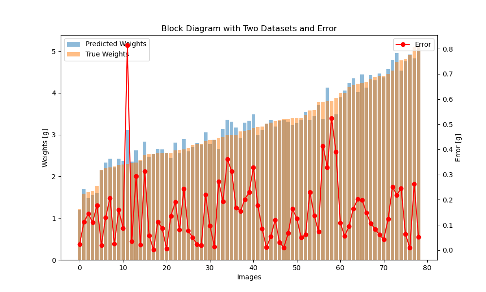
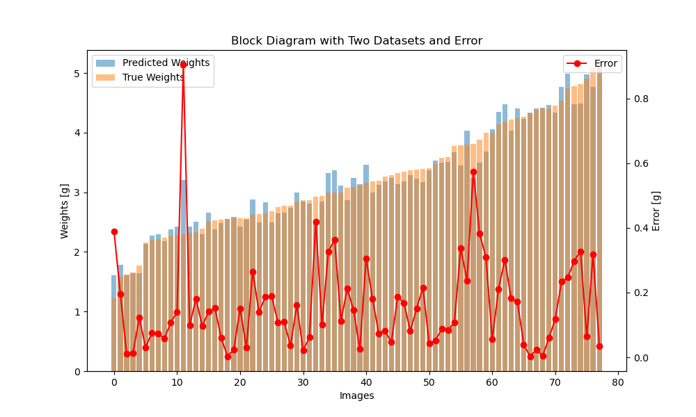

# Fish Size&Weight Estimation Platform

This is the source code of paper:

**AI-Powered Real-Time Precision Measurement of Fish Morphometrics and Weight.**

We provide an auto AI-based fish size&weight estimation platform to speed up fish parameter measurements.

## Dataset

weight data summary:

    Average: 3.1761438846588135 g, 
    Max Weight: 7.28000020980835 g, 
    Min Weight: 0.6600000262260437 g, 
    Mediam: 3.0799999237060547 g
## Size Prediction
Predict Length and Height of a fish.

    Length Error:
    Average: 0.16352812945842743 cm, 
    Max Error: 1.3571410179138184 cm, 
    Min Error: 0.0009355545043945312 cm, 
    Mediam: 0.10247135162353516 cm

## Weight Prediction

FeedFoward NN:

    Weight Error:
    Average: 0.0959256961941719 g, 
    Max : 1.1504442691802979 g, 
    Min : -0.8314871788024902 g, 
    Mediam : 0.0901954174041748 g

XGBoost:

    Weight Error:
    Average: 0.020155910402536392 g, 
    Max : 0.5028817653656006 g, 
    Min : -0.9480986595153809 g, 
    Mediam : 0.023881912231445312 g

## Platform 
Error results from detection & segmentation:

* Open a calibration reference image to acquire the real size factor first.

* Open a folder with fish images, and start your fish size/weight estimation operation.

The saved Excel is located in the current project path, with corresponding image names, fish length [cm], width [cm], area [cm $^2$], and weight [g].

