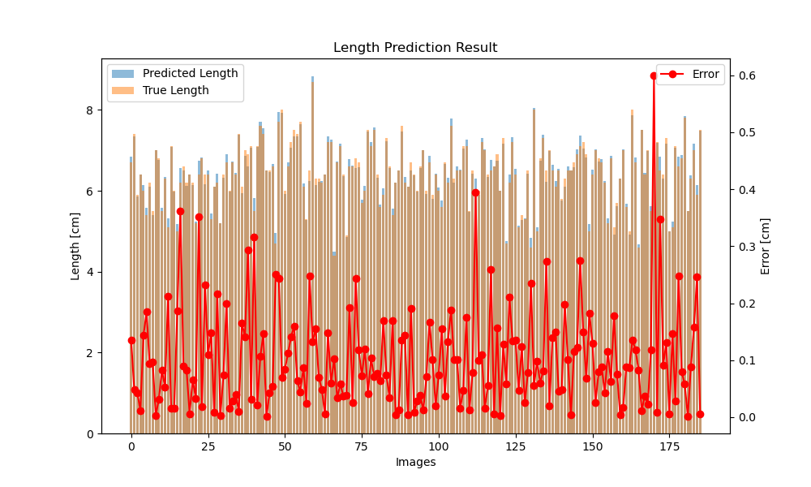

# Current Process

## Dataset

weight data summary:

    Average: 3.1761438846588135 g, 
    Max Weight: 7.28000020980835 g, 
    Min Weight: 0.6600000262260437 g, 
    Mediam: 3.0799999237060547 g
## Size Prediction
Predict Length and Height of a fish.

    Length Error:
    Average: 0.16352812945842743 cm, 
    Max Error: 1.3571410179138184 cm, 
    Min Error: 0.0009355545043945312 cm, 
    Mediam: 0.10247135162353516 cm

TO DO:
Get rid of outliers/segment fish manually for further weight prediction.

## Weight Prediction

FeedFoward NN:

    Weight Error:
    Average: 0.0959256961941719 g, 
    Max : 1.1504442691802979 g, 
    Min : -0.8314871788024902 g, 
    Mediam : 0.0901954174041748 g

XGBoost:

    Weight Error:
    Average: 0.020155910402536392 g, 
    Max : 0.5028817653656006 g, 
    Min : -0.9480986595153809 g, 
    Mediam : 0.023881912231445312 g

## Error Evaluation
Error results from detection & segmentation:

* wrong width and height infomation is generated.

Error results from model prediction: