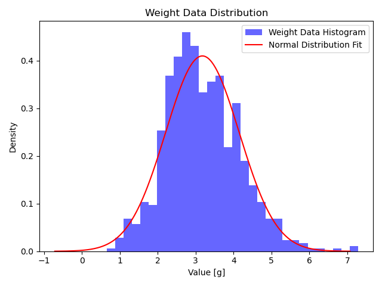
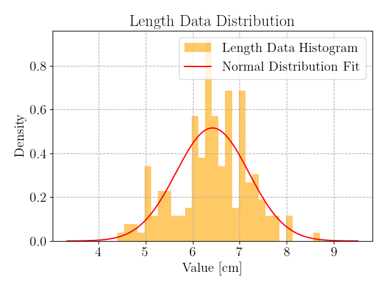

# Fish Size&Weight Estimation Platform

This is the source code of the paper:

**AI-Powered Real-Time Precision Measurement of Fish Morphometrics and Weight.**

We provide an auto AI-based fish size and weight estimation platform to speed up fish parameter measurements.

## Detection Performance
The size measurement error is less than 0.13 cm. The weight estimation error is less than 0.179 grams. 

## Dataset

We have around 900 salmon fish images with manually measured lengths and weights. Please leave your emails in the issues section if you need them. 

The dataset distribution is shown as follows:

## Weight Prediction
Please refer to our paper for more details. 

Basically, we compared our proposed model with a simple feedforward NN and XGBoost model.

Some raw results:

Feedforward NN:

    Weight Error:
    Average: 0.0959256961941719 g, 
    Max: 1.1504442691802979 g, 
    Min: -0.8314871788024902 g, 
    Median: 0.0901954174041748 g

XGBoost:

    Weight Error:
    Average: 0.020155910402536392 g, 
    Max: 0.5028817653656006 g, 
    Min: -0.9480986595153809 g, 
    Median: 0.023881912231445312 g

## Platform 
Build with Python API and JavaScript.

* Open a calibration reference image to acquire the real size factor first.

* Open a folder with fish images and start your fish size/weight estimation operation.

The saved Excel is located in the current project path, with corresponding image names, fish length [cm], width [cm], area [cm $^2$], and weight [g].

## Acknowledgement
Fish detection and segmentation pre-trained models:
https://github.com/fishial/fish-identification.git

